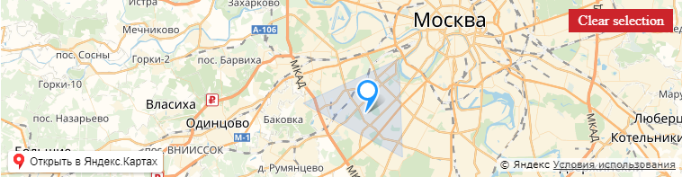

## install

npm i vue-yandex-map

## use

```html
<yandex-map
    :center="[55.681576, 37.488467]"
    :zoom="10"
    :dragable="false"
    :scrollZoom="false"
    @created="mapCreated">
    @destroy="mapDestroy">
        <region-select
          button-text="Please select ..."
          :region="[[55.761104221485205, 37.589244608215324],[55.753360214866454, 37.519893411926276], [55.74329069752624, 37.57207847052001]]"
          @changed="regionChanged">
        </region-select>
</yandex-map>
```

example app

```js

import YandexMap from 'vue-yandex-map'
Vue.use(YandexMap, {
    version: '2.1',
    lang: 'ru_RU',
    apiKey: '',
});

export default {
      name: 'app',
      data () {
        return {
          map: null,
          map_data: [],
          mapObjectManager: null
        }
      },
      methods: {
        yamapReady: function () {

        },
        mapCreated: function ($map) {
          console.info('mapCreated, $map=', $map)

          this.map = $map
          this.mapObjectManager = new ymaps.ObjectManager({
            clusterize: false,
            gridSize: 60,
            clusterMinClusterSize: 5,
            clusterHasBalloon: true, // Опции кластеров задаются с префиксом cluster.
            geoObjectOpenBalloonOnClick: false // Опции геообъектов задаются с префиксом geoObject
          })

          this.map.behaviors.disable('drag')

          // set ObjectManager events
          this.map.events.add(['click'], function(){
            this.mapObjectManager.objects.balloon.close()
          })

          // add points on map
          // ...
        },
        mapDestroy: function($map) {
          console.info('mapDestroy')
        },
        regionChanged: function ($coordinates, $polygon) {

          console.info('regionChanged, coord=', $coordinates)

          let visibleID = [];

          if (typeof $polygon === 'undefined') {
            $polygon = null;
          }

          this.map.behaviors.disable('drag');

          // check points in region
          this.mapObjectManager.setFilter(function (object) {

            let in_poligon = $polygon === null ? false : $polygon.geometry.contains(object.geometry.coordinates);
            let visible = $polygon === null ? true :  in_poligon;

            if($polygon !== null && in_poligon) {
              visibleID.push(object.id)
            }

            return visible
          })

          console.log('map, selected point ID', visibleID)
        }
      }
    }
```

## screenshot



### yandex-map properties

| Name   | Type  | Required | Default | Description |
| ------ |:-----:| :---------:| --------|:---------|
| center | Array | false     | []       | set map center |
| zoom | Number | false     | 15       | set map zoom |
| dragable | Boolean | false | true    | enable drag map |
| scrollZoom | Boolean | false | true    | enable zoom on scroll |

### yandex-map events
| Name   | params | Description |
| ------ |:-----:|:---------|
| created | map  |  when creating the map |
| destroy | map  |  when destroy the map |
| click | map, position  |  when click on map |
| boundschange | map, bounds  |  when change bounds |

### region-select properties
| Name   | Type  | Required | Default | Description |
| ------ |:-----:| :---------:| --------|:---------|
| button-text | String | false  |        | set button text |
| button-selected-text | String | false  |        | set button selected text |
| button-cancel-text | String | false  |        | set button cancel text |
| region | Array | false  | []      | set region |

### region-select events
| Name   | params | Description |
| ------ |:-----:|:---------|
| changed | coordinates |  when changing the selection |
| status | status |  when changing the selection status [init, selected, cancel]|

https://domatskiy.github.io/vue-yandex-map/
